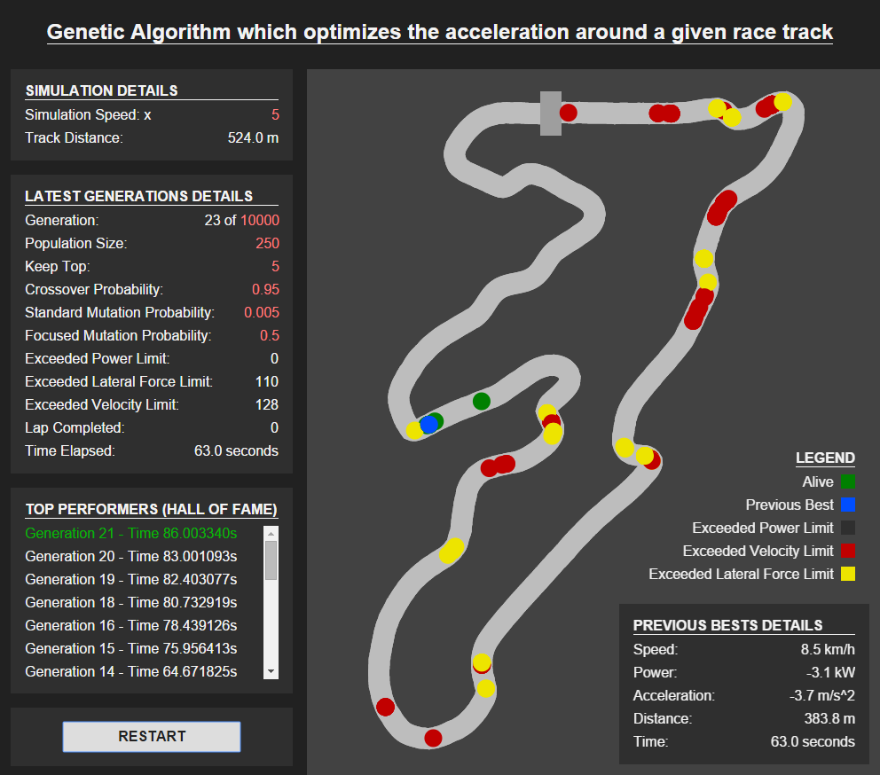
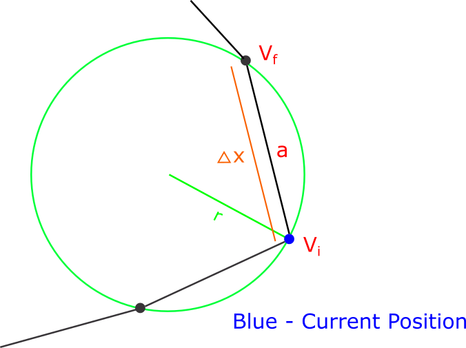
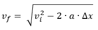
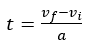
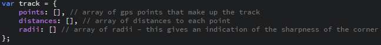
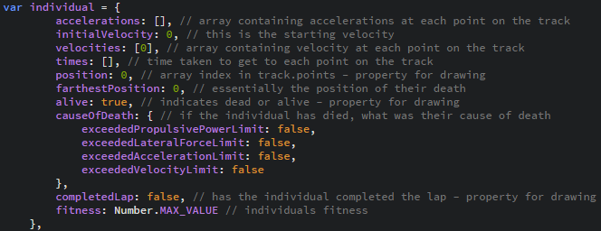
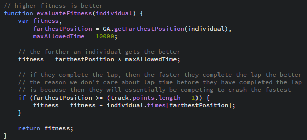
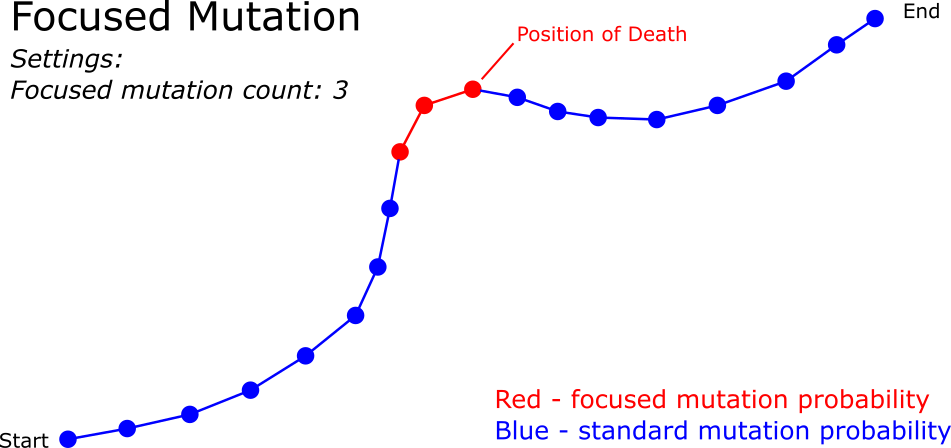

# A genetic algorithm which optimizes the acceleration around a given race track

Live demo: https://jamesdeklerk.github.io/genetic-algorithm-race-track/

---

# Interface Details 

  

### **Simulation Details**
This includes general details about the simulation, for example how fast the simulation is running.

### **Latest Generations Details**
This includes the live details of the current generation as they proceed through the simulation.

### **Top Performers (Hall of Fame)**
This includes all the top performers/individuals generation number along with lap time. If the individual completed the lap, the text appears green, else the text appears white.

### **Legend**
This is a color coding of the individual’s current state. For example, green represents alive.

### **Previous Bests Details**
This includes the live details of the previous best individual as they proceed through the simulation.

### **Editable Values**
The values in pink can be changed, in order to apply these changes, you must click the “RESTART” button. For example, to increase the Simulation Speed, you can enter a new value and click “RESTART”.

### **Track Details**
Each individual is represented by a dot on the track, where each dot is color coded to represent their current state.

---

# Physics

  

v_i – initial velocity (i.e. the velocity at the current point)  
v_f – final velocity (i.e. the velocity at the next point)  
∆x – distance (i.e. the distance between the current and next point)  
a – acceleration (i.e. constant acceleration between the current and next point)  
r – radius of curvature (at the current point)  

### **Equations Used (not in Vehicle Performance Limits)**
Calculating the final velocity (i.e. the velocity at the next point)  
  
Calculating the time at the current point  
  

---

# Program Details
Variables
- Population size
- Max generations
- Tournament size – number of randomly selected individuals to compete in each tournament
- Population to replace – number of individuals to replace with offspring from two tournament selected parents.
- Top fittest individuals to keep – the top x individuals to keep exactly as they are for the next generation.
- Search space min – lowest acceleration
- Search space max – highest acceleration
- Crossover probability – the probability of two individuals being crossed over, if they aren’t crossed over, one of the parents is randomly selected as the offspring.
- Decrease the mutation probability with fitness – this is a true or false setting allowing for what is says.
- Focused mutation count – this is the number of points on the track which should have the focused mutation probability.
Note: focused mutation is the concept of focusing the mutation on a specific area, namely the area before the individual died.
- Focused mutation probability – probability of being mutated given the point lies in the focus area.
- Standard mutation probability – the probability of being mutated in any other situation.

### **Track Logic** 
  
Given a set of GPS points, plot the race track. The race track is essentially a large number of straight lines drawn between the track points. But in order to implement the physics correctly one needed the distances to each point as well as to calculate the angle of each bend, this is what the distance and radii arrays are for.

### **Individuals Details**
  
 
### **Updating an individual**
This requires passing in an individual with an array of accelerations.
1.	Update the velocities array – done by calculating the velocities at each point using the initialVelocity, accelerations array and track distances array.
2.	Update the times array – done by using the previous and current velocities and the acceleration over that distance.
3.	Update the farthest position.
4.	Update/evaluate the fitness.

### **Fitness function**
  
 
### **Crossover function**
This function crosses over two parents with a certain probability. 
1.	Crossover - If they are to be crossed over, then a random crossover point is chosen and the crossover is performed. Else if they are not chosen for crossover, one of the parents is selected as the offspring.
2.	Update individual’s fitness – the individual has most likely changed so the fitness value needs to be updated.

### **Mutation function**
This function mutates and individual (specifically their acceleration values) with a given probability.
1.	For each acceleration value:
a.	Check whether to use the focused or standard mutation probability.
b.	Mutate that acceleration value with a given probability.
2.	Update individual’s fitness – the individual has most likely changed so the fitness value needs to be updated.
#### Focused mutation explained:
  
 
### **Genetic Algorithm Implementation (the GA.getNextGeneration function)**
1.	Get the fittest individual of the current population (soon to become the previous generation).
2.	Update population using tournament selection:
a.	Sort the population according to fitness
b.	Replace the set number of individuals with offspring crossed over parents, for each individual to be replaced, the parents are selected using tournament selection.
3.	Mutate population – for each individual except for the top fittest individuals to keep, run them through the mutation function.
4.	Update current generation count – this is because now we are on the next generation since we have selected and mutated the individuals from the previous generation.
5.	Get the fittest individual of the updated population (new generation)
6.	If the fittest individual of the updated population is fitter than the fittest individual of the previous population, add that individual to the hall of fame array.
7.	Return the new population.

### **Graphics/Interface Implementation**
1.	Set up the interface – drawing the track and setting the default interface values.
2.	Reset the Genetic Algorithm – clearing and resetting the information from the previous run.
3.	Generate initial population – based on the details given, create the initial population, this is done by creating random individuals.
4.	Start the animation:
a.	Update the interface – here, all of the interface details (except the hall of fame) are updated and each individual (represented by a dot) gets redrawn at its current position (based on time).
b.	Repeat 4 a. until all the individuals have either died or completed the lap.
c.	Update Top Performers (Hall of Fame) on the interface.
d.	Get the next generation – this is where the current population is “sent through” the genetic algorithm and the next generation is created.
e.	Repeat step 4 a. until the max number of generations has been completed.
